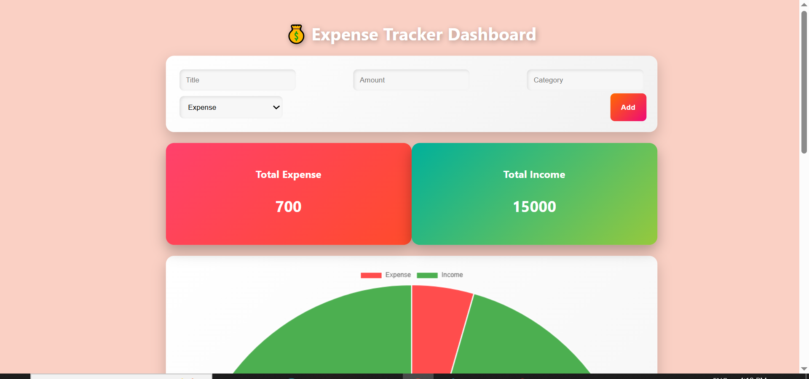
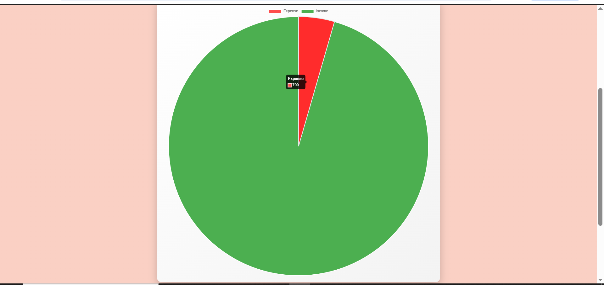
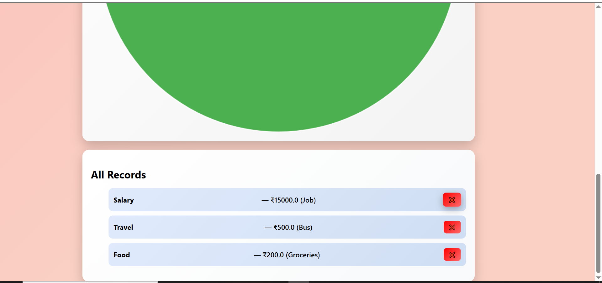

# 💸 Expense Tracker Web App

A simple and user-friendly web application to track daily expenses.

---

## 🚀 Features

- ➕ Add new expenses
- 🗑️ Delete expenses
- 📊 View all records in table format
- 💰 Calculate total expense
- 🎨 Attractive colorful UI

---

## 🛠️ Tech Stack

- HTML
- CSS
- JavaScript
- Python (Flask)
- SQLite

---

## 📸 Screenshots

### 🏠 Home Page

### ➕ Add Expense

### 📋 Expense Table

### 💰 Total Expense

---

## ⚙️ How to Run

1. Clone the repository  
git clone https://github.com/Shubhamtejankar/expense-tracker.git

2. Install dependencies  
pip install -r requirements.txt

3. Run the app  
python app.py

4. Open in browser  
http://127.0.0.1:5000

---

## 📌 Author

- Shubham Tejankar